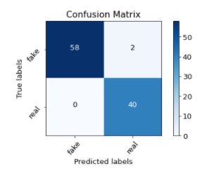
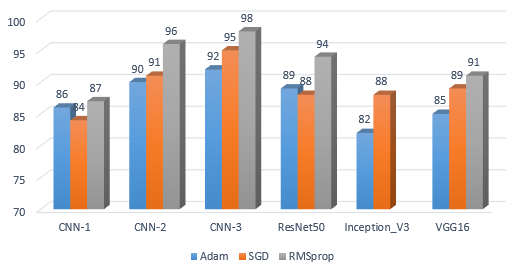

# Signature-Authentication-using-Deep-Learning
Signature Authentication using Deep Learning with CNN
Data used can be downloaded from https://www.kaggle.com/raavisoni/signaturesigcomp
Results:
Confusion matrix

Comparision with state-of-art models

